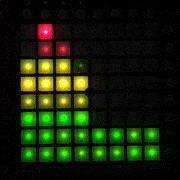

# pLaunchPadMini

A JAVA wrapper for the Novation Launch Pad aimed at using the MIDI pads as input for Processing sketches.
You can attach pads to variables, and use the device to control and adjust your animation.

* [Installation](#installation)
* [Quick guide and examples](#quick-guide)
* [Compatibility](#compatibility)
* [Limitations and further development](#limitations-and-further-development) 

# Installation
## From Processing editor
In Processing, go to `Sketch`, `Import library...`, `Add library`. Search for "Novation Launch Controller client" and once found, click `Install`.
## Manual installation
Copy the file pLaunchController.jar to a folder `code` inside your sketch. This method makes the library available to an individual sketch.
If you intend to make the library available to all sketches, unzip the pLaunchController.zip file to the libraries of your Processing installation (you can see the default skecthbook location in File -> Preferences).

# Quick guide
See [Examples](../examples/README.md) for a quick introduction on how to use the library. Once you install the library from Processing, you can also run the examples
from `File -> Examples... -> Contributed Libraries ->  Novation LaunchPadMini client`.

# Compatibility
The library was developed in Windows 10 and it has been tested with Processing 3.3 
and Processing 3.4 in both Windows 10 and Mac OS 10. If you have trouble using the 
library, please [submit an issue](https://github.com/haschdl/pLaunchPadMini/issues/new). 

# Limitations and further development
The library was developed and tested only the smallest of the Novation controllers, 
Launch Control, which has 16 knobs and 8 pads. If you are interested in using other Novation products please 
[submit an issue](https://github.com/haschdl/pLaunchPadMini/issues/new) and I will
evaluate what can be done. 
​                                                                              
