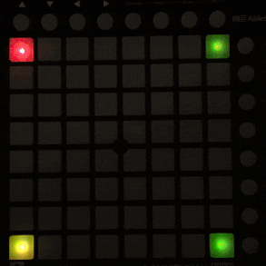
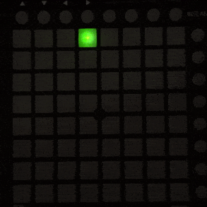
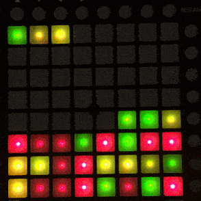
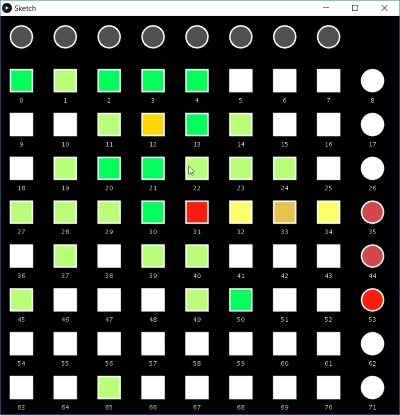

# Launch Pad MINI - Examples

* [Basics 1 - LED Colors](#basics-1---LED-colors)
* [Basics 2 - Pad mode](#basics-2---pad-mode)
* [Basics 3 - Events](#basics-3---events)
* [Advanced 1 - Audio Analyzer](#advanced-1--audio-analyzer)

## Basics 1 - LED Colors

File:  Basics_1_LED_Colors.pde

Run the sketch and click on the screen to switch across the examples. See below images for the examples 4 to 6.

### 4: Animation

``` Java
x = 3;
y = 3;
int m = Math.round(1.5 * (1 + cos((float)frameCount*TWO_PI/10)));

controller.setLedColor(x-m, y-m, LED_COLOR.getRandom(true));
controller.setLedColor(x-m, y+1+m, LED_COLOR.getRandom(true));
controller.setLedColor(x+1+m, y-m, LED_COLOR.getRandom(true));
controller.setLedColor(x+1+m, y+1+m, LED_COLOR.getRandom(true));
```




### 5: Looping

 Looping in first row with `setLedColor(column, row, color)`.

```Java
controller.reset();
int col = frameCount % 8;
controller.setLedColor(col, 0, LED_COLOR.GREEN_FULL); 
```


### 6: Looping

Looping across whole matrix with random color (`LED_COLOR.getRandom()`).



## Basics 2 - Pad mode



## Basics 3 - Events


## Advanced 1 - Audio analyzer
This sample uses the controller to show the audio levels for 8 frequence bands. It requires the contributed library Minim.
See video [here](https://www.reddit.com/r/processing/comments/9rdeby/some_tests_with_launchpad_mini_for_processing_got/)  


